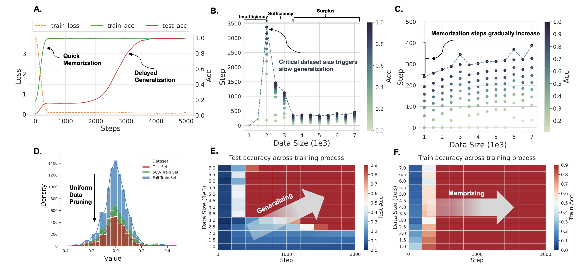

# Critical Data Size of Language Models from a Grokking Perspective

This repo inculdes the offical code in the paper [Critical Data Size of Language Models from a Grokking Perspective](https://arxiv.org/pdf/2401.10463.pdf).



## Prerequisites

- `torch` >= 2.0
- `transformers`


## Quick Start

### 1. Grokking On IMDB

Execute the following command to re-produce our results: 

```shell

sh run_grokking_on_imdb.sh

```


### 2. Grokking on Yelp 


```shell
sh run_grokking_on_yelp.sh
```
